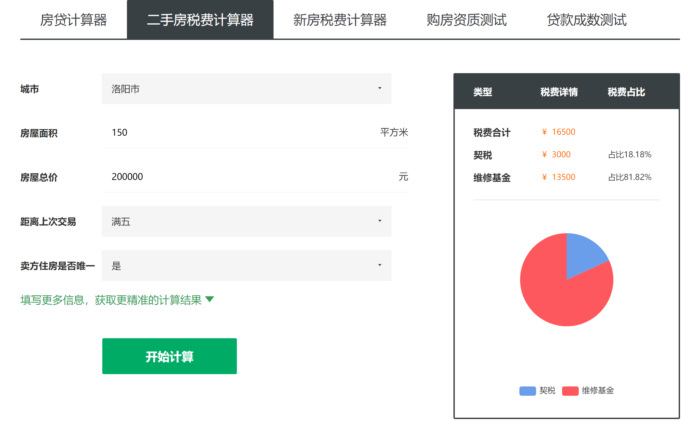
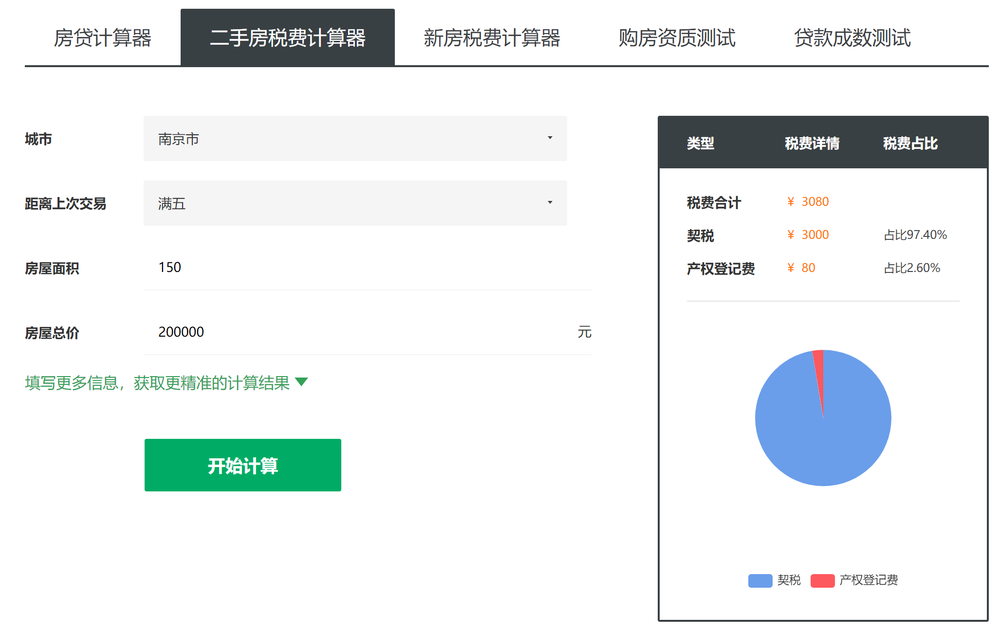
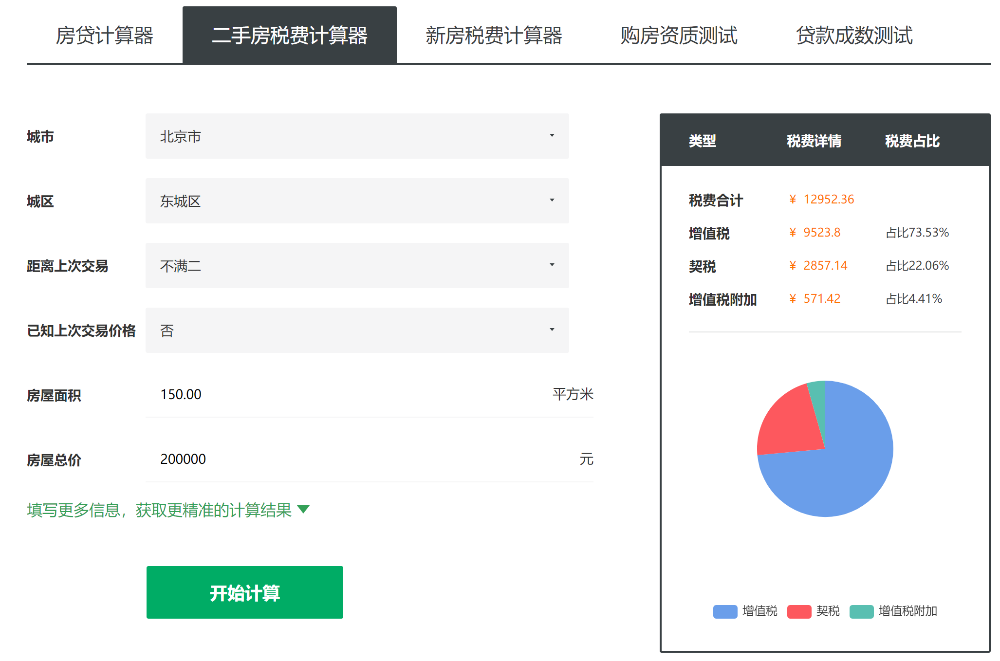
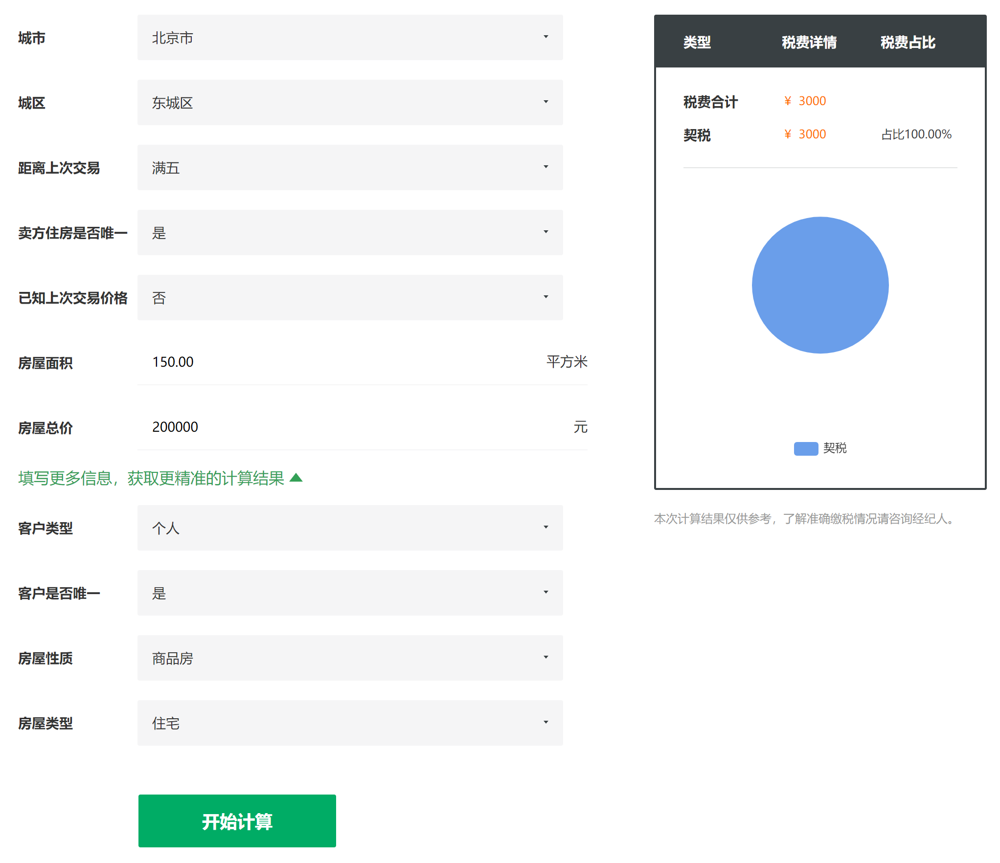

以下是从[链家的网站](https://sz.lianjia.com/tool/esfsf/)上截的几个图。这个工具是给中介帮二手房买卖双方计算税费使用的。






其核心逻辑是收集房子，卖家，买家三个业务实体的属性。然后根据当地的法规制度，计算出各种税费的税率，然后算出总共应该交的税费的总表。

# 单个 React 组件

我们可以把所有这些城市的业务逻辑，都实现在一个 React 组件里。

* 渲染空的表单
* 响应表单的用户输入
* 计算出表单的联动状态
* 响应开始计算按钮
* 实现计算逻辑
* 渲染税费总表和饼图

React 16 的函数式组件就是一个函数。我们可以认为，整个业务也就是一个超级大的函数。这个函数通过 useState，包含了在页面上的状态。如果我们把 useState 通过 local storage 持久化，可以认为这是一个包含了数据库的，前后端一体的完整应用程序。如果我们再把这个界面给买家，卖家分别使用，各自填写自己的信息。那么这个函数就实现了一个多角色协作的业务流程。

# 调整模块边界

一个函数包含了

* 展示界面，业务计算，持久化
* 买家，卖家
* 北京，南京，洛阳……
* 增值税，契税……

显然，对这一个 React 组件，我们需要进行模块化拆分。我们可以有多种模块之间边界的选择

* 一个组件只负责展示，一个函数负责逻辑计算，一个函数负责数据库读写
* 一个组件面向买家，一个组件面向卖家
* 一个组件负责抽象的计算器，每个城市一个实例化的组件装配自己的参数
* 每个税费种类一个模块，然后把税费各自依赖的输入合并成一个大的表单

不同的模块边界选择，是基于对于“什么是易变”的不同判断。这样可以尽量把易变的部分隔离到独立的模块里去修改。假设说，我们判断，城市是易变的。希望做到新增一个城市的时候，可以只是新增一个模块。那么，模块拆分之后大概是这个样子：

```tsx
function TaxCalculator(props: {
    fields: { shouldShowIsOnlyApartment: boolean, ... },
    calcTaxRates: () => { qisuiRate: number, zengzhisuiRate: number, ... }
}) {
    return <div> ... </div>
}

function BeijingTaxCalculator() {
    function calcBeijingTaxRate(props) {
        // ...
    }
    return <TaxCalculator fields={fields} calcTaxRates={calcBeijingTaxRates} />
}
```

# 调整模块的打包和部署模式

调整有两个方向

* 保持打包部署模式不变，调整模块之间的边界，重新定义接口
* 保持模块边界不变，保持接口不变，但是调整打包和部署模式

那么在保持上面定义的模块边界的前提下，我们有哪些打包和部署的选择呢?

## 配置化

在上面的例子里，fields 和 calcBeijingTaxRates 这两个参数是程序员在源代码编辑的阶段给定的。这种打包和部署模式是以源代码git管理参数的模式。
我们可以选择把 fields 和 calcBeijingTaxRates，从源代码里提取出来，放到配置系统里。运行时就可以不用改源代码，不用重新走源代码发布系统，而是通过配置发布系统来发布了。

## 自助化

配置系统往往仍然是一个高风险的操作。可以进一步把这个配置做成图形化界面，由运营人员在运营系统里直接修改。甚至可以提供拖拽的方式，让运营人员去做一些字段顺序调整的事情。再高级一点，可以搞出 lowcode 的概念来。

## 静态求值

我们知道，如果我们在代码里写了 3 * 5 的话，编译器会在编译的时候直接优化成15，而不是运行时再去计算。我们这里，静态传递了参数

```tsx
<TaxCalculator fields={fields} calcTaxRates={calcBeijingTaxRates} />
```

那编译器也可以进行“静态求值”，就是把 fields 和 calcBeijingTaxRates 代入到函数里，静态生成一个北京版的计算器。这个做法也就是所谓的代码生成。

## Feature Branch

比静态代码生成更静态的办法就是给每一个城市一个 git 分支，把这个城市的特殊逻辑维护到这个 git 分支里。

## 静态链接 / 动态链接 / 微服务

常见的 .a 文件和 .so 文件也是打包部署技术，微服务独立一个 RPC 进程也是打包部署技术。这个就不赘述了。