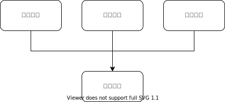

假设在一个虚构的出行业务里，我们有如下的模块划分结构



计费模块提供了统计一个订单的里程，综合计算出费用的功能。专车，快车，企业等业务线都会复用这个计费模块来出自己的账单，收取费用。
我们不讨论是否是小前台大中台。这个问题和大小没关系，也和这些模块现存的代码量没有关系。
我们来考虑一个问题，就是当需求来了的时候，应该改哪个模块的问题。

假设快车需要做一个拼车的功能，需要给司机出一个账单，给乘客出另外一个账单。司机需要按实际行驶时长和里程计费，乘客只需要一个一口价就可以。那么我们改哪个模块呢?
如果改计费模块，那么大概是这样的

```
beginOrder(orderDetails, isPinChe) {
}
```

根据这个 isPinChe 的标志位，计费模块会计算出两个账单出来。但是似乎里程计算并不受到影响，因为实际上只有司机需要计算里程。

然后我们又添加了一个需求，如果司机的账单和乘客的一口价之间差价过大，则可能是司机故意绕路，骗取平台的补贴。那么这个时候，需求就是要把乘客的账单从一口价，改成乘客所乘坐区段的实际账单。
注意这个实际乘坐区段并不等于司机的行程里程。因为如果有两个乘客前后上车，两个乘客的区段重叠之后合计里程，才是司机的行驶里程。
那这个时候计费模块就需要维护订单和行程，两个级别的账单。

```
beginTrip() {
}
beginOrder(orderDetails, isPinChe) {
}
```

这个会造成一个问题，就是这个功能其实是快车产品线独有的。企业出行的产品是不需要这部分代码的，但是他们有自己的独特需求。
企业出行的需求是他需要能够以快车的费用给企业报销，但是实际乘客是打的专车，然后用专车计费模式计算出来的账单是乘客+乘客所在企业实际需要支付给平台的。
快车费用和专车费用之间的差价，需要由乘客本人自己补齐。之前的拼车行程是一个司机账单，再给每个乘客一个账单。而企业的订单是企业一个账单，乘客一个账单。
然后，我们又接着修改计费模块

```
beginOrder(orderDetails, isPinChe, isQiYe) {
}
```

我们可以看到，这个模式的显著缺点：

* 计费模块和其用户之间的接口会越来越复杂，isXXX 的参数越加越多。这些复杂性是大部分用户用不到的，但是被迫接受。
* 计费模块被多个业务线复用，其稳定性会影响很大。对计费模块的频繁修改，导致所有业务线的稳定性都受到影响。

如果仅仅根据上面这两个需求，与其把一个计费模块做大做强，把计费模块拆成多个是更合理的

* 司机的行程计费
* 乘客的专车计费
* 乘客的快车计费

然后由上层的模块，由这些**依赖关系上处于更不稳定位置**的模块，去写不稳定的业务逻辑。
比如一个拼车行程，就包括了乘客和司机两份账单。比如一个企业订单，就需要给乘客做两份账单，然后再计算出哪些是需要乘客补齐的部分。