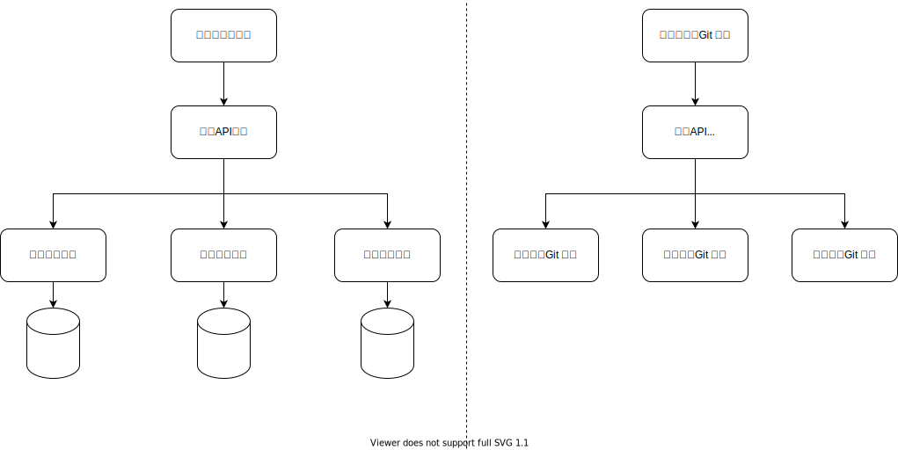
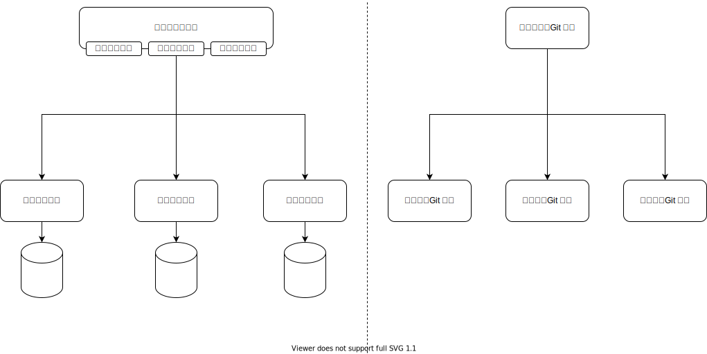
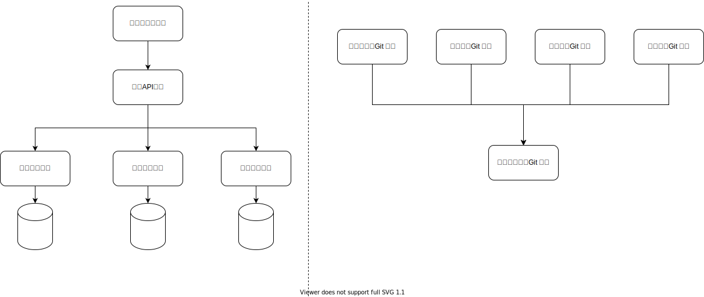
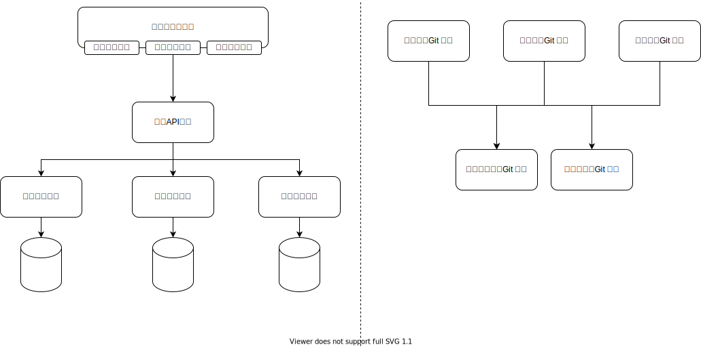
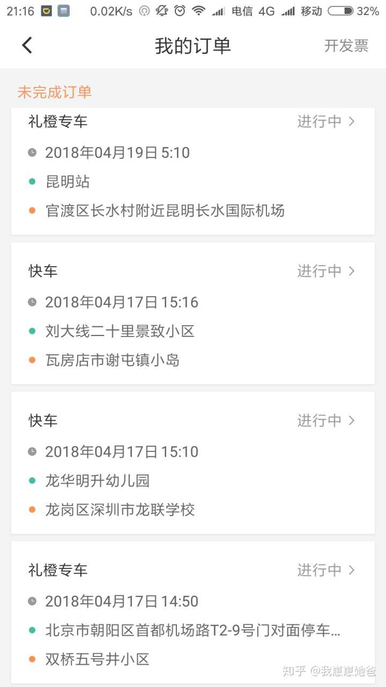
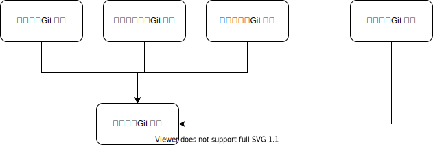
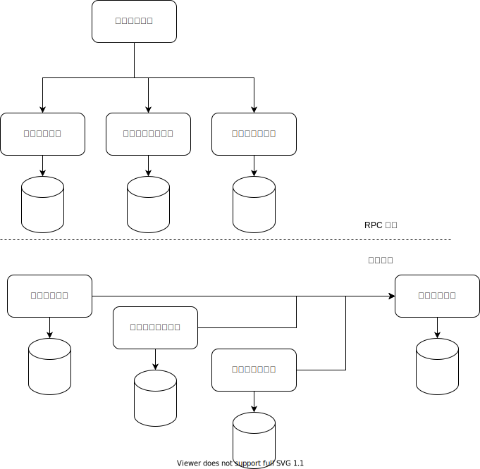

# 离散型 UI

这一类的需求是展示一个界面。界面上可以非常很多个块。每一块的业务逻辑都可以分离到一个独立的Git仓库里。

称之为离散型是因为“离得比较开”，块与块之间非常独立。

例如下面这样的界面


## 数据集成

我们可以使用服务端数据集成的方式来实现这个需求。



这种集成方式

* 从依赖方向上：业务API依赖买家信息，配送信息，付款信息
* 从接口形态上：接口是数据，所有的字段都需要明确定义

## UI集成

我们可以使用客户端UI集成的方式来实现这个需求。



配送信息，付款信息，买家信息的Git仓库同时提供服务端进程，以及客户端的组件。从进程部署上是两个，从Git仓库的角度是一起的。
这种做从一端到另一端贯通的做法，一般也称为“竖切”。

这种集成方式

* 从依赖方向上：和上面的数据集成一样，业务API依赖买家信息，配送信息，付款信息
* 从接口形态上：接口是UI，买家信息 Git 仓库对外提供的接口是一个 UI 组件。业务客户端 Git 仓库不需要知道这个 UI 组件会渲染什么字段。

## 数据当成UI来集成

虽然在服务端做集成，但是把接口定义成UI一样的黑盒。

例如，这样的伪代码

```ts
function getOrderDetail(): Record<string, any> {
    return {
        buyer: getBuyerDetail(),
        fulfilment: getFulfilmentDetail(),
        payment: getPaymentDetail()
    }
}
```

数据在服务端完成聚合，但是聚合的过程是简单的粘合，就像 UI 组件组合成大界面一样。

这种集成方式

* 从依赖方向上：和上面的数据集成一样，业务API依赖买家信息，配送信息，付款信息
* 从接口形态上：接口是当成UI来用的黑盒数据

## 依赖倒置的服务端API

负责集成的服务端API可以在依赖关系上被倒置



服务端API进程在调用关系上不改变。但是从依赖关系上，服务端API的Git仓库不再完成具体业务，而是下沉为底层的“通用数据网关”。

* 从依赖方向上：通用数据网关变成底层模块，依赖关系倒置。具体的买家信息，配送信息，付款信息成为插件
* 从接口形态上：接口是当成UI来用的黑盒数据

## 依赖倒置的客户端

负责集成的客户端Git仓库也在依赖关系上被倒置



客户端的Git仓库不再完成所有的具体业务，而是留出界面插槽（Slot），由买家信息，配送信息，付款信息在界面上做填充。

* 从依赖方向上：买家信息，配送信息，付款信息在最顶层。客户端的Git仓库倒置到底层，只处理业务之间的布局，也就是描述这些业务如何集成到一起。
* 从接口形态上：接口是黑盒的UI

## 规范型 UI

规范型 UI 比离散型 UI 更简单一些。例如



这类 UI 的特点就是集成界面具有规律性。可以抽象成规则性的组件的重复。
如果有规律性，那显然可以搞个接口进行依赖倒置。



* 从依赖方向上：订单条目的 Git 仓库位于依赖关系的底层。快车，专车，顺风车依赖订单条目的 Git 仓库，实现其接口。订单列表依赖订单条目，负责渲染。
* 从接口形态上：接口是规范型的数据，订单条目的 Git 仓库定义了这个数据结构的每个字段

读取订单列表的时候用 RPC 聚合。也可以是订单列表提供一个数据库，由每个业务线负责写入。这两种做法不改变 Git 仓库之间的依赖关系，从 Autonomy 的角度来说也是一样的。



## 小结

从 Autonomy 的角度来说，使用 UI 做为接口，比使用数据做为接口更能自主变化。
因为展示细节变了，拿 UI 做为接口的情况，接口大概率是不需要修改的。
除非展示需求正好改的是界面布局这样的大尺度上的东西。

如果不使用依赖倒置，每个新需求写在哪个 Git 仓库里，会有一些争议性。比如用数据集成的方式来做这个界面，我们可以在业务API这个Git仓库里做所有的需求，因为它有所有的数据。
那配送信息要做一些日期格式化的调整是去改业务API的Git仓库呢，还是改配送信息的Git仓库呢。
在使用依赖倒置的情况下，接口需要显式地提炼出来，并有意去最小化接口部分。
从而可以让更多的需求改动封闭在更上层的依赖关系里完成，更多去改实现代码，而不是改接口代码。

拿UI做接口，依赖倒置，目的都是让接口改得少。从而使得跨团队的沟通量变小，提高 Autonomy。
