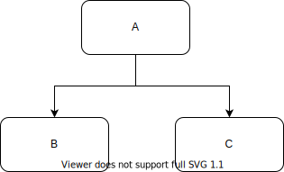
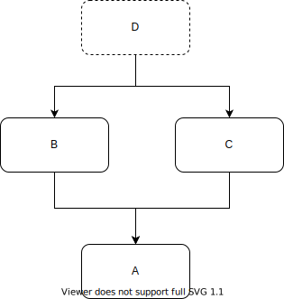

最理想的拆分后又组合的方式是“粘贴”到一起。就像你把一块砖，劈开了。拼装回去就是把两半又放一起。也就是我们可以有一个通用的函数 integrate(comp1, comp2, .. compN)。很多组件化系统都是这么吹捧自己的，比如说父类与子类，最终拼装出结果，这个拼装就是继承规则。比如说 OSGi，一堆 bundle，不用管他们是什么，都可以用同样的方式拼装起来。然而，我们都知道业务逻辑拆分出 git 仓库之后，往往是没有办法用通用的函数组合回去的。

比如说我们需要描述两个模块提供的按钮，哪个在哪个的左边。比如说我们要拼装两条促销规则，要说明哪个用了之后哪个就不能用了。这些业务上的空间组合，时间组合是必不可少的。

任何向你推销通用的组合式组件系统的人，最终都会搞出一个配置文件给你写“装配逻辑”。这样的模块装配文件就是没事找事，本来可以用大家都懂的 javascript 解决的问题，要变成用 XML 换了花来写。

我们如果拆出了 B 和 C 这两个 Git 仓库。理论上只有两种把 B 和 C 集成起来的办法：

# 编排

引入一个 A 仓库，它依赖了 B 和 C。



# 依赖倒置

引入一个 A 仓库，提供接口。由 B 和 C 实现这个接口，插入到 A 上。就像主板和显卡那样，A 就是主板，B 和 C 就是显卡。



在 B 和 C 上面还需要一个仓库 D 把大家都包括进去，但是这个仓库里可以没有业务逻辑了。
与编排的区别在于，编排的方式里，A 是可以依赖任意 B 和 C 的实现细节的，没有必要声明哪些是接口，哪些是实现。
在依赖倒置的模式下，如果 A 没有声明接口让 B 和 C 实现，B 和 C 就没有办法通过 A 把它们俩集成到一起去。

# 集成发生在“文件”中

业务逻辑会拆分成

* 文件
* 文件夹
* Git 仓库

在这个里面，文件的作用就是“集成”。比如最最常用的方式

```ts
function functionA() {
    funcitonB();
    functionC();
}
```

我们把 functionA 放在 A 中，functionB 和 functionC 放在 B/C 中。这就是最常用的“编排”集成方式。通过把它们放在一个文件中，我们声明了 functionB 要发生在 functionC 之前，说明了时间上的顺序规则。

如果我们用的是 React 写界面，可以声明

```ts
function functionA() {
    return <ul><li><functionB/></li><li><functionC/></li></ul>
}
```

这个就说明了在界面上，functionB 要放在 functionC 的上一行。通过一个文件，说明了空间上的顺序规则。
这也说明了文件的主要意义，它是用来把逻辑在时间和空间上做集成的。
如果两行代码，写在同一个文件，和写两个文件里，没有啥区别。
那说明这两行代码没有必要强行塞到同一个文件里。比如你写了一个 User.ts，有用户可以发招租的界面样式代码，也有用户买外卖的处理过程代码。
这些没有强烈时空上集成规则的两个东西都强行塞到 User.ts 里，实际上就没有利用好“文件”的特殊性质，是对稀缺注意力资源的浪费。

# 熟知需求模式的意义

既然把两个没有之间依赖关系的B/C仓库，集成到一起只有编排和依赖倒置两种做法。
是不是只知道原则，就可以做好拆分了？
枚举出常见的需求仍然是非常有意义的。因为：

* 抽象的A、B、C这样的描述是没有代入感的。遇到实际的业务逻辑，仍然不知道怎么拆解。
* 在实际的业务实现过程中，经常发现 Autonomy 的反模式。这些反面例子比正面例子更有教育意义。
* 书本上理想化的说教经常没法套入产品经理乱七八糟的需求里。我不仅仅需要看上去美的小例子，也要有一些实现起来其实挺难受的恶心例子。

产品经理很少会从 Autonomy 的角度去思考问题，更多是从一个整体效果的角度来看。
拆分是因为没法写一起实现这个约束引起的副作用，是实现细节。
产品经理和开发者的常见矛盾就在于一个从整体效果出发，而另外一个则从拆分出的细节出发。
熟知需求模式，是为了把纷繁复杂的需求，往有限的模式里套。
当套不进去的时候，思考一下是不是 Consistency 方面有问题，这个地方做得这么特殊，有什么特别的收益嘛。