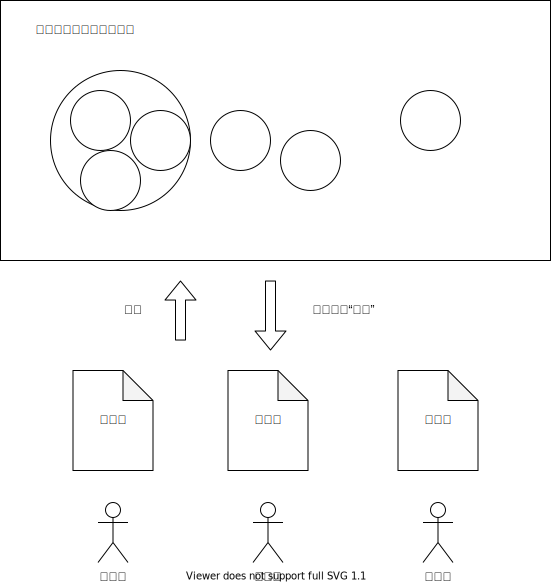

# 隔离

业务逻辑无论如何做拆分，最终仍然是要跑起来，集成到一起去的。
无论是编辑时拆分成文件、文件夹、Git仓库，还是运行时拆分成进程，拆分无可避免地引入了“降低反馈速度”的副作用。
一旦产生了分工，就会有你不了解的部分。这也是分工的本意所在，控制知识边界，让普通人也可以参与劳动。
但是软件是要整体集成到一起才能发挥其全部价值。这种“整体”与“部分”的矛盾，造成了Feedback问题。

要减轻分工带来的负面影响，最重要的是做好“甩锅”。
换句话说就是要做好“隔离”，虽然我们把所有的部件都集成到了一起了，但是我们仍然要在“运行时”通过各种手段人为制造出边界，把责任隔离出来。
把责任隔离出来，就是把运行时的行为，与背后负责的团队与个人对应起来。

用户看到的问题永远是前端的问题，那不可能所有的bug都是前端的锅。
前端也可能是一个多业务线共享的 App，出 bug 的地方可能是共享的地图模块呢？
反馈来自“运行”，然后一次次被传递。如果“运行时”没做好隔离，反馈分发流转给开发者的效率就会变低。

# 隔离的两大场景

有很多隔离模式来加快反馈的速度，有两大场景：

* 控制变更：外部输入没变化，变更运行时。变更之前可以工作，变更之后不工作了，那就是变更引起的问题。
* 控制边界：运行时没变更，外部输入发生变化时出问题了。不需要知道边界里面是什么逻辑，所有人都使用统一的方式来定义边界。出了问题可以快速排除不是自己的问题。

“一致性”需求的很大来源就是为了用统一的方式来定义边界，比如都接同一套监控系统，使得分工协作的时候不需要掌握那么多门外语。

# 微服务

微服务的起源是 devops 运动。鼓励 dev 拥有自己的线上服务，dev 自己来做 ops 的工作从而减少沟通成本。
毫无疑问，微服务的合理性并不是从 Autonomy 或者 Consistency 出发，而是以 Feedback 为主要的出发点。

当一个 7*24 的互联网高并发应用稳定性成问题的时候，最合理的做法是什么？据 Google SRE 统计，线上70%的故障都是由某种变更而触发的。
控制变更的速度，尽量延长灰度发布的时间是最重要的事情。
如果变更的粒度只有进程，而进程又只有一个，那么势必上线的队列会过长。
那么拆分微服务是延长灰度发布时间最有效的手段。
同时让每个 dev 直接负责线上服务的稳定性告警，可以极大加快故障的定位和处置速度。

那么是不是拆分进程一时爽，一直拆分一直爽呢？
很多过度使用微服务的分布式系统无一例外地遇到了严重的 Feedback 问题。
那么难道应该是强调一个业务就应该一个团队端到端负责，重新打起 Monolith 的大旗吗？
这其实就等价于说，怎么分技术的进程，应该取决于业务部门的组织架构。
但是业务部门的组织架构也是三天两头调整的。就是技术部门想要跟着调，业务部门每调整一次，集群就完全重部署一次SRE也不会同意的。

那么怎么拆分进程才是合理的呢？为什么这么拆就是合理的呢？