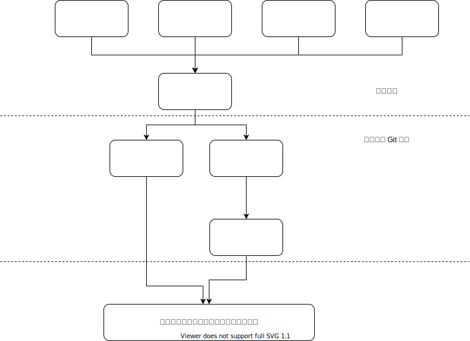

在整个依赖关系树上面，我们可以画一根线。线之上的 Git 仓库定位就是一次性的，满足特定的业务需求。
线之下的 Git 仓库定位是“保证整体的一致性”。
实际上这些可复用的东西，与编程语言，操作系统，物理硬件差不多。
区别仅仅是“开源社区共识”，还是“公司部门范围内的共识”。
它们都约束了上层的业务代码用什么“语言”来描述自己的业务逻辑。

如果完全放弃“一致性”会如何？最常见的抱怨是重复发明轮子，然而这个问题不是简单的重复投入问题。
单纯从节省工作量的角度出发是无法说服你的同事用你的轮子的。

* 对客户可见的一致性：显然色系，交互模式这些东西要保持一致。
* 影响同事们获得 Feedback 速度：响应故障的时候还要去看这个模块自研的监控系统，那就太耽误时间了。
* 为了 Autonomy 需要做依赖倒置：依赖倒置是建立在一套共识的规范上的，可能会要求使用同样的编程语言，同样的工具链。

值得保持一致的场景不会很多，这里根据有限的经验，列举几个常见的场景。
对于每个场景我们要如何说服其他人，让他们相信这个东西值得保持一致。
另外就是具体看一下在这些场景下，如何做“接入率”，“阻断率”的计算，以确保我们达成的一致被持续保持。