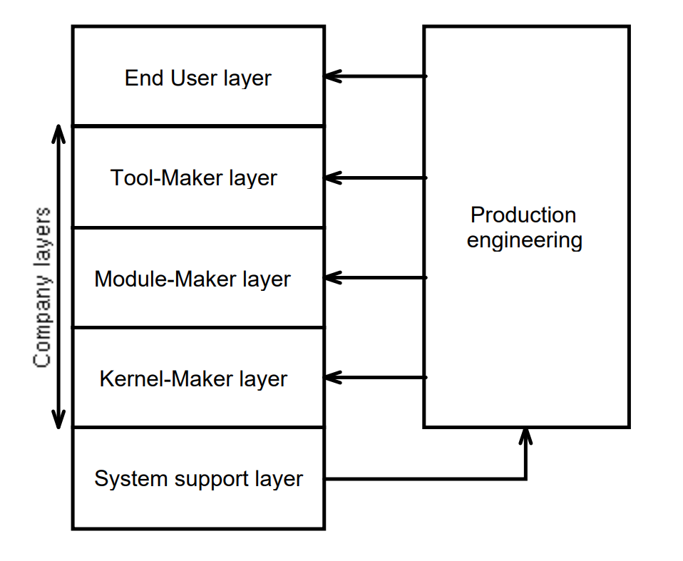

# 问题

如何才能像大师一样，上来就知道抽象的接口应该如何定义? 我为什么总是想不出来该怎么抽象?

# 分析

大师们鼓吹从底往上构建抽象，把软件工程当数学定理证明一样来搞，这条路是走不通的。

David Parnas 写过一篇文章“[Designing Software for Ease of Extension and Contraction](./designing-software-for-ease-of-extension-and-contraction.pdf)”。里面提到了虚拟机的愿景，一帮程序员写一个虚拟机，给另外一帮程序员来用。那我怎么知道这个虚拟机的指令集应该设计成什么样呢?

Trygve Reenskaug 写过一本书“[Working with objects - The OOram Software Engineering Method](./working-with-objects-the-ooram-software-engineering-method.pdf)”。里面有一张图展示了Trygve， MVC 之父对未来架构的愿景

这种自底而上，逐层构建抽象的做法是看起来很美好的。但是实践中，我们怎么能知道“抽象”是正确的呢?怎么能凭空发明出来呢?

这个问题的解决方案就是不要自底而上。而是先使用，再复用。当你看见了多个变种的业务之后，他们公共的接口应该定义成什么样子应该是显而易见的。